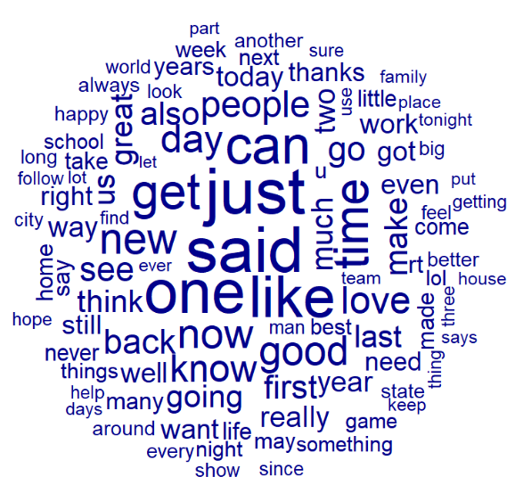
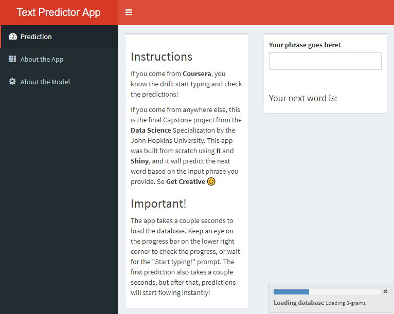

Text Prediction App!
========================================================
transition: rotate
author: Gonzalo Nelis S.
date: 05/01/2021
width: 1440
height: 900
autosize: true

About the Capstone Project
========================================================

The objective of the project was building a text prediction App, just like [Microsoft Swiftkey](https://www.microsoft.com/en-us/swiftkey). The app must be fast, reliable and efficient to mimic a normal smartphone performance.

A brief analysis about the data provided to this project can be found in [here](https://rpubs.com/gnelis/707645). The most common words (omitting stopwords) are displayed in the wordcloud.

***

About the Model
========================================================

I opted for a **greedy back-off model**, fairly similar to the [Stupid Back-off model](https://www.aclweb.org/anthology/D07-1090.pdf). It's based on n-grams and finds the prediction on a large collection of base-prediction pairs derived from a corpus dataset. For this case, the model uses n-grams from n=4 to n=2.

The model receives and input phrase, and look for the last n-grams in the prediction dataset, from the largest to the smallest n-grams (n=4 to n=2). If it finds a match, save the prediction.

The greediness is related to the stop criterion: the model stops as soon as it finds 3 or more predictions. It does not check all the n-grams datasets. Moreover, the datasets only contain the three most frequent predictions for each n-gram. The stupid back-off model, on the other hand, finds a large number of candidates and assigns them a score based on relative frequency and back-off weights.

Why did I use a greedy approach? Well, the Stupid Back-off model was really popular, and I just wanted to test if using a simpler model delivered good results. 

### And according to this [benchmark](https://github.com/hfoffani/dsci-benchmark), it sacrifices around 2% accuracy compared to a Stupid Back-off model **(22% vs 20%)**.

About the App
========================================================

### The app was built using shiny, and you can find it here:  https://gnelis.shinyapps.io/TextPrediction/

A blank rectangle accepts the user input. The app is totally reactive, and predictions are displayed while the user is writing.

It reads the dataset first, so a progress bar lets the user know that the app is loading. A "Start typing!" prompt lets them know when it is ready to go.

The app also have instructions and information about the project, the model and the app, with links to useful resources for the user. All scripts for data cleaning, predictive model and shiny app can be found in [Github.](https://github.com/gnelis/Capstone)

***

========================================================

# Thanks for watching!
